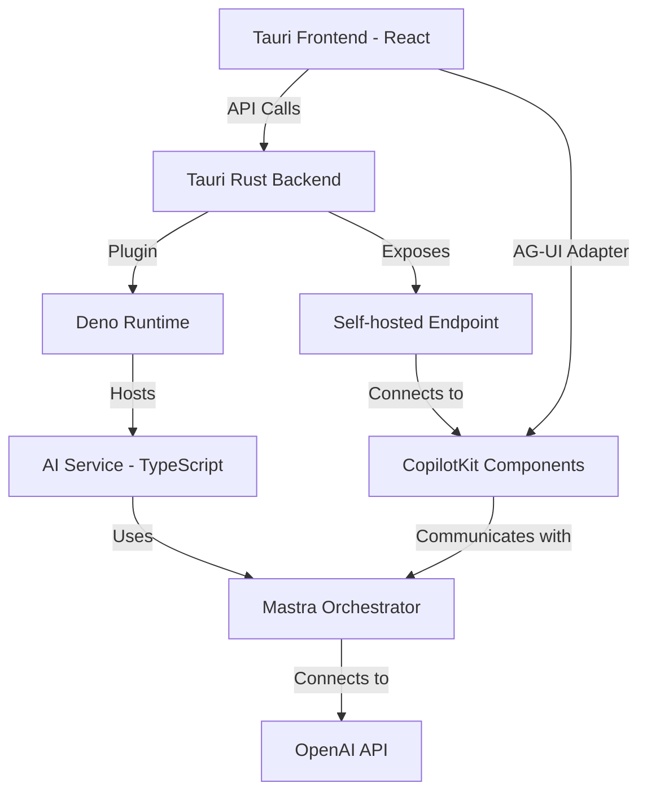

# Architectural Plan: CopilotKit Integration with Self-Hosted Endpoint in Tauri 2.5.1

## 1. Overview

This architectural plan outlines the integration of CopilotKit with a self-hosted endpoint in a Tauri 2.5.1 application. The solution will provide a chat interface for user assistance using OpenAI as the LLM provider, with a focus on security for handling sensitive data. The architecture includes a Deno application hosted within the Tauri app that will handle model selection and serve as the AI service, with a Mastra orchestrator agent managing the interactions.

## 2. System Architecture



## 3. Component Details

### 3.1 Frontend Components

1. **React Application**
   - Uses CopilotKit React components (`@copilotkit/react-ui`, `@copilotkit/react-core`)
   - Implements the chat interface for user interaction
   - Connects to the self-hosted endpoint via the CopilotKit provider

2. **AG-UI Adapter**
   - Integrates with CopilotKit to provide a bridge between the frontend and the Mastra agent
   - Formats requests and responses according to the AG-UI protocol
   - Handles state synchronization between the UI and the agent

### 3.2 Backend Components

1. **Tauri Rust Backend**
   - Exposes a self-hosted endpoint for CopilotKit
   - Manages security and authentication
   - Loads and initializes the Deno runtime
   - Handles communication between the frontend and the Deno application

2. **Deno Runtime (via tauri-plugin-deno)**
   - Runs JavaScript/TypeScript code within the Tauri application
   - Provides isolation and security for the AI service
   - Manages the execution environment for the Mastra orchestrator

3. **AI Service (TypeScript in Deno)**
   - Located in `apps/ai-service` directory
   - Handles model selection and configuration
   - Implements the business logic for the chat interface
   - Manages the connection to the OpenAI API

4. **Mastra Orchestrator Agent**
   - Orchestrates the flow of requests and responses
   - Manages the conversation context
   - Handles complex interactions that may require multiple steps or services

## 4. Dependencies

### 4.1 Frontend Dependencies

```json
{
  "dependencies": {
    "@copilotkit/react-ui": "^1.8.13",
    "@copilotkit/react-core": "^1.8.13",
    "@copilotkit/runtime": "^1.8.13",
    "@mastra/client-js": "latest"
  }
}
```

### 4.2 Backend Dependencies

#### Rust Dependencies (Cargo.toml)

```toml
[dependencies]
tauri = { version = "2.5.1", features = ["api-all"] }
tauri-plugin-deno = "0.1.0"
serde = { version = "1.0", features = ["derive"] }
serde_json = "1.0"
tokio = { version = "1.28", features = ["full"] }
```

#### Deno Dependencies

```typescript
// deps.ts
export { Mastra } from "https://deno.land/x/mastra/mod.ts";
export { OpenAI } from "https://deno.land/x/openai/mod.ts";
```

## 5. Implementation Plan

### 5.1 Tauri Configuration Changes

The `tauri.conf.json` file needs to be updated to include the necessary permissions and configurations:

```json
{
  "tauri": {
    "allowlist": {
      "http": {
        "all": true,
        "request": true,
        "scope": ["https://api.openai.com/*"]
      },
      "fs": {
        "all": true,
        "scope": ["$APP/*"]
      }
    },
    "bundle": {
      "active": true,
      "resources": ["apps/ai-service/**/*"]
    },
    "security": {
      "csp": "default-src 'self'; connect-src 'self' https://api.openai.com;"
    }
  }
}
```

### 5.2 Rust Backend Implementation

The Rust backend needs to be extended to:
1. Initialize the Deno runtime
2. Expose an endpoint for CopilotKit
3. Handle communication between the frontend and the Deno application

```rust
// src-tauri/src/lib.rs
use tauri_plugin_deno::DenoPlugin;
use serde::{Serialize, Deserialize};

#[derive(Debug, Serialize, Deserialize)]
struct CopilotRequest {
    message: String,
    context: Option<serde_json::Value>,
}

#[derive(Debug, Serialize, Deserialize)]
struct CopilotResponse {
    message: String,
    actions: Option<Vec<serde_json::Value>>,
}

#[tauri::command]
async fn copilot_endpoint(request: CopilotRequest) -> Result<CopilotResponse, String> {
    // Forward the request to the Deno runtime
    let deno_response = tauri::execute_promise_sync(|app_handle| {
        let deno = app_handle.state::<DenoPlugin>();
        deno.execute("copilot", "handleCopilotRequest", &serde_json::to_string(&request).unwrap())
    }).map_err(|e| e.to_string())?;
    
    // Parse the response
    let response: CopilotResponse = serde_json::from_str(&deno_response)
        .map_err(|e| format!("Failed to parse Deno response: {}", e))?;
    
    Ok(response)
}

#[cfg_attr(mobile, tauri::mobile_entry_point)]
pub fn run() {
    tauri::Builder::default()
        .plugin(DenoPlugin::init())
        .invoke_handler(tauri::generate_handler![copilot_endpoint])
        .setup(|app| {
            // Initialize the Deno runtime with the AI service
            let deno = app.state::<DenoPlugin>();
            deno.execute_script("init", include_str!("../apps/ai-service/main.ts"))
                .map_err(|e| e.to_string())?;
            Ok(())
        })
        .run(tauri::generate_context!())
        .expect("error while running tauri application");
}
```

### 5.3 Deno AI Service Implementation

The Deno AI service will be implemented in TypeScript and located in the `apps/ai-service` directory:

```typescript
// apps/ai-service/main.ts
import { Mastra, OpenAI } from "./deps.ts";

// Initialize OpenAI client
const openai = new OpenAI({
  apiKey: Deno.env.get("OPENAI_API_KEY") || "",
});

// Initialize Mastra
const mastra = new Mastra({
  storage: "memory",
  logger: {
    level: "info",
  },
});

// Register the Mastra agent
mastra.registerAgent("copilot", {
  name: "Copilot Assistant",
  description: "A helpful assistant that can answer questions and provide assistance.",
  model: "gpt-4o",
  provider: "openai",
});

// Handle CopilotKit requests
globalThis.handleCopilotRequest = async (requestJson: string) => {
  const request = JSON.parse(requestJson);
  
  // Process the request using Mastra
  const response = await mastra.agents.copilot.chat({
    messages: [
      { role: "user", content: request.message }
    ],
    context: request.context || {},
  });
  
  return JSON.stringify({
    message: response.content,
    actions: response.actions || [],
  });
};

console.log("AI Service initialized successfully");
```

### 5.4 Frontend Integration

The React frontend needs to be updated to integrate with CopilotKit and the AG-UI adapter:

```tsx
// src/components/CopilotProvider.tsx
import { CopilotKit, CopilotChatbox } from "@copilotkit/react-ui";
import { CopilotProvider } from "@copilotkit/react-core";
import { MastraClient } from "@mastra/client-js";

// Initialize Mastra client for AG-UI adapter
const mastraClient = new MastraClient({
  endpoint: "/api/copilotkit", // This will be handled by our Tauri backend
});

export function CopilotKitProvider({ children }: { children: React.ReactNode }) {
  return (
    <CopilotProvider
      runtimeUrl="/api/copilotkit" // This will be handled by our Tauri backend
      agentAdapter={mastraClient.getAGUIAdapter()}
    >
      {children}
      <CopilotChatbox
        title="AI Assistant"
        placeholder="Ask me anything..."
        emptyStateComponent={
          <div className="p-4 text-center">
            <h3 className="text-lg font-medium">How can I help you today?</h3>
            <p className="text-sm text-gray-500">Ask me anything about your data or tasks.</p>
          </div>
        }
      />
    </CopilotProvider>
  );
}
```

```tsx
// src/App.tsx
import { useState } from "react";
import { CopilotKitProvider } from "./components/CopilotProvider";
import "./App.css";

function App() {
  // Your existing App code
  
  return (
    <CopilotKitProvider>
      <main className="container">
        {/* Your existing UI */}
      </main>
    </CopilotKitProvider>
  );
}

export default App;
```

## 6. Security Considerations

1. **API Key Management**
   - Store API keys securely using environment variables or a secure storage mechanism
   - Implement proper authentication for the self-hosted endpoint
   - Consider using a key rotation strategy for production environments

2. **Data Protection**
   - Implement encryption for sensitive data in transit and at rest
   - Ensure that the Deno runtime has appropriate permissions
   - Validate and sanitize all user inputs

3. **Isolation**
   - Use the Deno runtime's security features to isolate the AI service
   - Implement proper error handling to prevent information leakage
   - Consider implementing rate limiting for the API endpoint

## 7. Performance Considerations

1. **Caching**
   - Implement caching for frequently used responses
   - Consider using a local database for conversation history

2. **Streaming Responses**
   - Implement streaming for long responses to improve user experience
   - Use WebSockets or Server-Sent Events for real-time updates

3. **Resource Management**
   - Monitor memory usage of the Deno runtime
   - Implement proper cleanup of resources when they are no longer needed

## 8. Implementation Roadmap

1. **Phase 1: Setup and Configuration**
   - Install required dependencies
   - Configure Tauri with the Deno plugin
   - Set up the project structure

2. **Phase 2: Backend Implementation**
   - Implement the Rust backend with the Deno runtime
   - Create the AI service in TypeScript
   - Set up the Mastra orchestrator agent

3. **Phase 3: Frontend Integration**
   - Implement the CopilotKit provider
   - Set up the AG-UI adapter
   - Create the chat interface

4. **Phase 4: Testing and Optimization**
   - Test the integration end-to-end
   - Optimize performance
   - Address security concerns

5. **Phase 5: Deployment**
   - Package the application for distribution
   - Set up CI/CD pipelines
   - Create documentation

## 9. Conclusion

This architectural plan provides a comprehensive approach to integrating CopilotKit with a self-hosted endpoint in a Tauri 2.5.1 application. By leveraging the Deno runtime and Mastra orchestrator agent, we can create a secure and performant solution that meets the requirements for a chat interface using OpenAI as the LLM provider.

The implementation follows best practices for security and performance, while also providing flexibility for future enhancements. The modular architecture allows for easy maintenance and extension of the functionality as needed.
